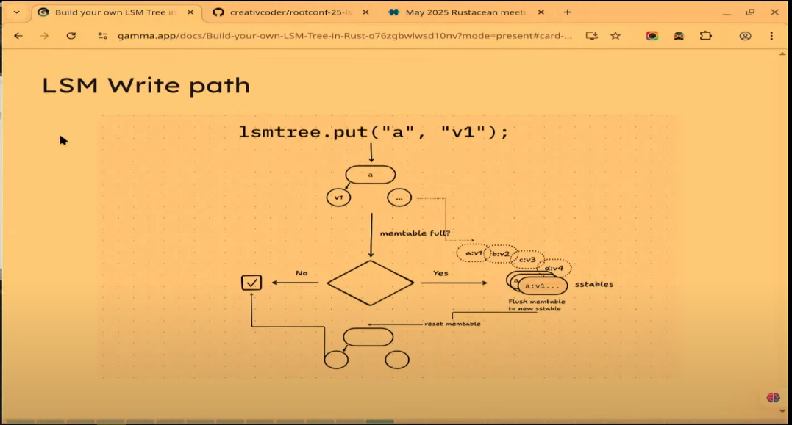
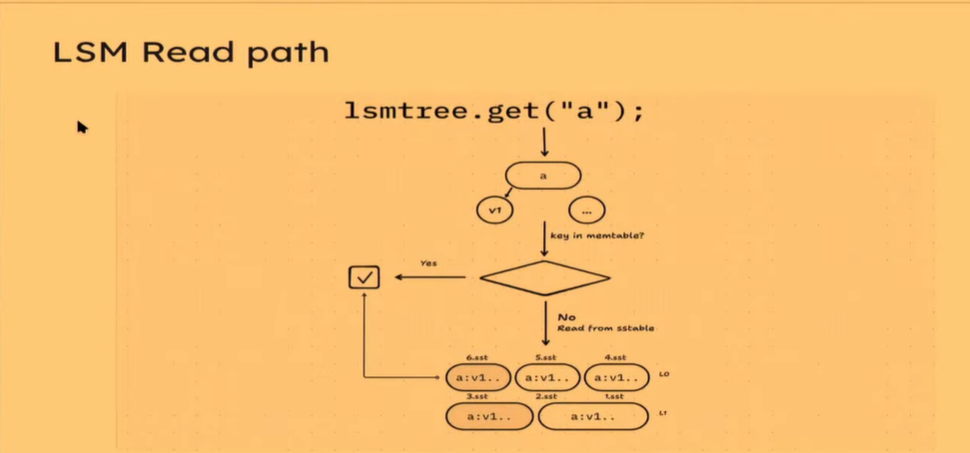

# B+ Tree based Implmentations
- B+ Tree is a balanced tree without any restriction on the number of keys and children in each node of the tree.
- Usually stored in pages on the disk.
- During inserts, to ensure the tree is balanced and the left child is lesser than the node of the tree, there could be reorganizing of data required, especially as the number of nodes increases.
- This usually results in writes becoming extremely slow as the size of the tree increaes.

# LSM Tree
- It is optimized for writes. Sequential writes over random writes.
- Higher write throughput for high volume data.
- Files on disk are sorted and do not require any rebalancing.
- Used for key value stores usually.
    - put (K, V)
    - get (K) -> Option<V>
    - delete (K)

- Uses SSTable for storing the data internally.
    - compact ([...SSTables]) -> [MergedSSTables];
    - get_range (K1..K5) -> [K1, v1, K2, v2, K3, v3, K4, v4]

## Components of an LSM Tree:

### Memtable
- This is an in memory tree like structure.
- Data has recently been written is stored in the Memtable.
- During writes, if the memtable is full, the data is flushed to a new SSTable segment.
- First point of contact for read/write.
- It is usually a skip list or a balanced tree.
    - BTree
    - AVL Tree
    - SkipList

### SSTable
- The segments are serialized versions of the Memtable data structure.
- It is an on disk structure.
- On memtable being full, data that is flushed to SSTable in a level called L0.
    - When L0 becomes full, it is Compacted to Level 1 -> L1.
    - Level N is compacted from previous levels.
    - Levels are just logical levels.
- Compaction runs to ensure the number of files don't grow out of control.
- The SSTable contains a sequence of sorted key value entries.
- For each SSTable file, there is a corresponding sparse index.
    - It's a pointer to some key value pair in the SSTable.
    - So there could be one entry for every 5 keys.
    - This way for every read, we can get the closest key from the sparse table and iterate from there.
- Bloom filters for the SSTables.
    - Give us non membership gaurantees from every file.
    - If the bloom filter says the key is not in the set, then for sure it is not in the set.
    - If the bloom filter says the key is in the set, then it may or may not be in the set.
    - https://systemdesign.one/bloom-filters-explained/

### WAL:
- After writing data into the memtable, data is written into the write-ahead-log.
- This protects against failures.

## SSTable File format:
- File header:
    - Contains an identifier called the magic bytes.
- Data blocks:
    - There could be multiple data blocks. They contain sorted key value sequences.
    - Each line contains: Key1 size, value 1 size, key 1, value 1.
- Filter Block:
    - This contains optional bloom filters.
- Index Block:
    - Sparse indexes to make the lookup faster.

## SSTable Compaction:
- No inplace writes are allowed in LSM trees. Sequential writes are prioritized.
- Deletes are a 'put' in disguise where the value is a special byte marker called the tombstone.
    - So even in the Memstore it is an insert, but with the value being a special value indicating that it is deleted.
- This will lead to deleted keys and values being accumulated over time.
- To ensure the number of files don't grow out of control, SSTable files are compacted at a given level.
- The compaction happens in the background and not in the write path. As a result, 
the writes are much quicker compared to traditional BTree based implementations.
- Compaction happens when a trigger condition.
    - The trigger condition could be based on the SSTable file size.
    - The trigger condition could be based on the time window.
    - The trigger condition could be based on the size of the whole level.

## LSM Write flow:

## LSM Read flow:

